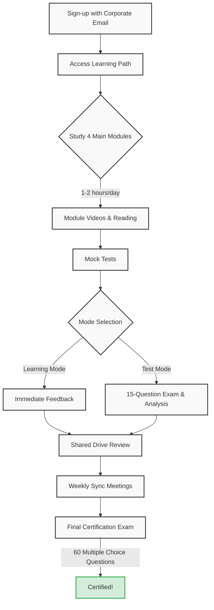

# 📋 Cloud Certification & Training Workshop: Kick-off Notes

## 1. Goals & Timeline
* **Time Remaining:** We have a 24-day timeline to achieve the certification goal.
* **Study Pace:** The target is to complete one section per day with approximately 1-2 hours of daily study. This pace ensures successful completion of the process.
* **Curriculum:** Completion of the 4 main modules on the "Partner Network Learning Path" is required.

## 2. Registration & Access Process
* **Sign-up:** Registration must be completed using a corporate email address. Access the system by setting a password via the activation email received.
* **Email Activation:** If activation is required, first log in with the corporate account via the email provider, update the password, and then return to the training dashboard.

## 3. Training Methodology & Tools
* **Course Tracking:** Each module consists of videos and reading materials. As sections are completed, they are marked on the system (check-list).
* **Mock Tests:** Practice tests for each module are located at the bottom of the page. Two modes are available:
  1. **Learning Mode:** Provides immediate explanations after answering a question.
  2. **Test Mode:** Conducts a 15-question exam and analyzes areas of weakness at the end.
* **Shared Storage:** Training content, transcripts generated from videos, and study notes are shared in a common shared drive folder.

## 4. Exam & Technical Details
* **Exam Format:** The exam consists of 60 multiple-choice questions. Direct coding is not expected; rather, knowledge of architecture, concepts, and best practices is evaluated.
* **Key Topics:**
  * Agent capabilities and workflows (Agentic Workflows).
  * Differences between Skills and Models, Plug-in usage.
  * Cost management (Which model is more economical, which performs better?).
  * Stateless architecture and token management (Context size, input tokens, etc.).
* **Is Software Background Required?:** Rather than in-depth coding knowledge, understanding high-level system architecture and communication schemas will be sufficient to pass the exam.

## 5. Decisions & Next Steps
* **Weekly Meetings:** Joint study sessions will be scheduled based on availability. A poll will be created for this.
* **Knowledge Sharing:** Team members will share their certification journey and step-by-step progress via a centralized repository.
* **Recording:** This meeting recording will be added to the top of the training page for team members who will watch it later.

## 📈 Certification Journey

